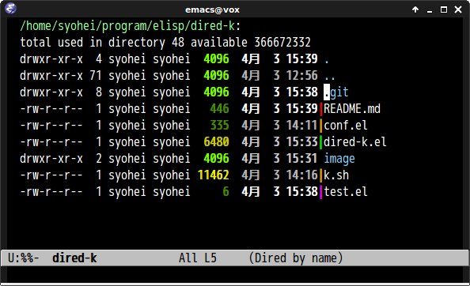

# dired-k.el [](https://travis-ci.org/syohex/emacs-dired-k)

`dired-k.el` highlights dired buffer like [k](https://github.com/supercrabtree/k).

(This may works only default dired setting)


## screenshot

### k.zsh style



### git status --short style


## Installation

You can install `dired-k` from [MELPA](http://melpa.milkbox.net/) with package.el.


## Commands

### `dired-k`

Highlight dired buffer by following parameters.

- File size
- Modified time
- Git status(if here is in git repository)


## Customization

### `dired-k-style`(Default `nil`)

View like `k.zsh` if this value is `nil`. View like `git status --short` if
this value is `'git`.


## Sample Configuration

```lisp
(require 'dired-k)
(define-key dired-mode-map (kbd "K") 'dired-k)

;; You can use dired-k alternative to revert-buffer
(define-key dired-mode-map (kbd "g") 'dired-k)

;; always execute dired-k when dired buffer is opened
(add-hook 'dired-initial-position-hook 'dired-k)
```
